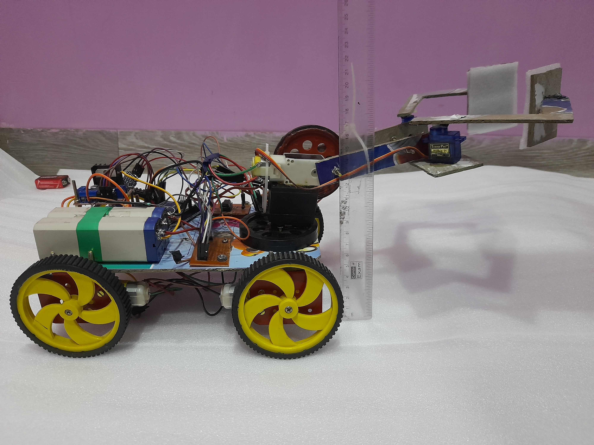
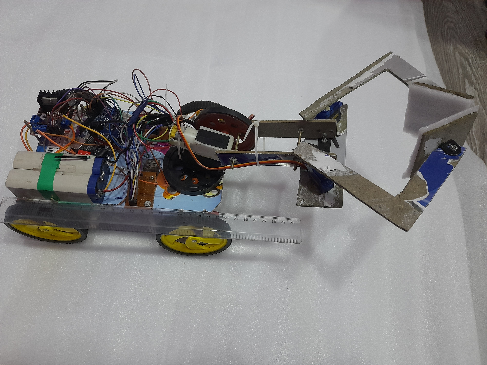
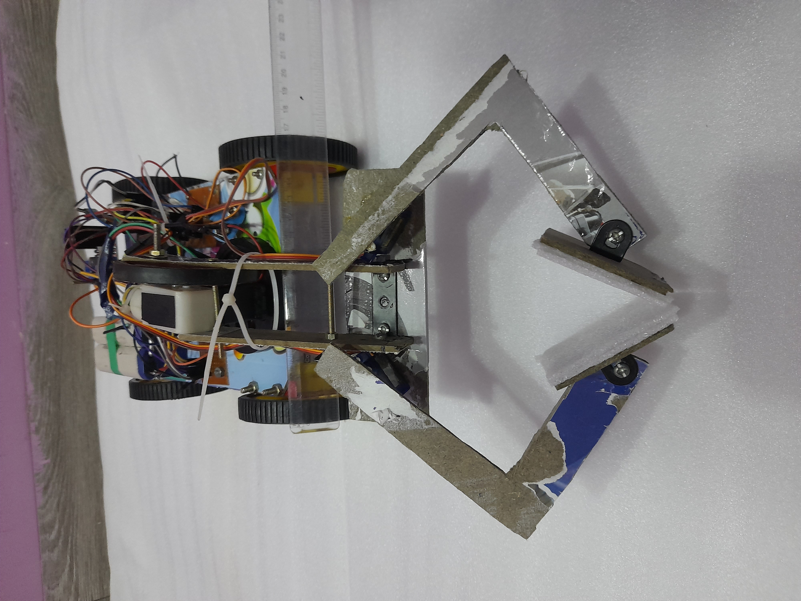
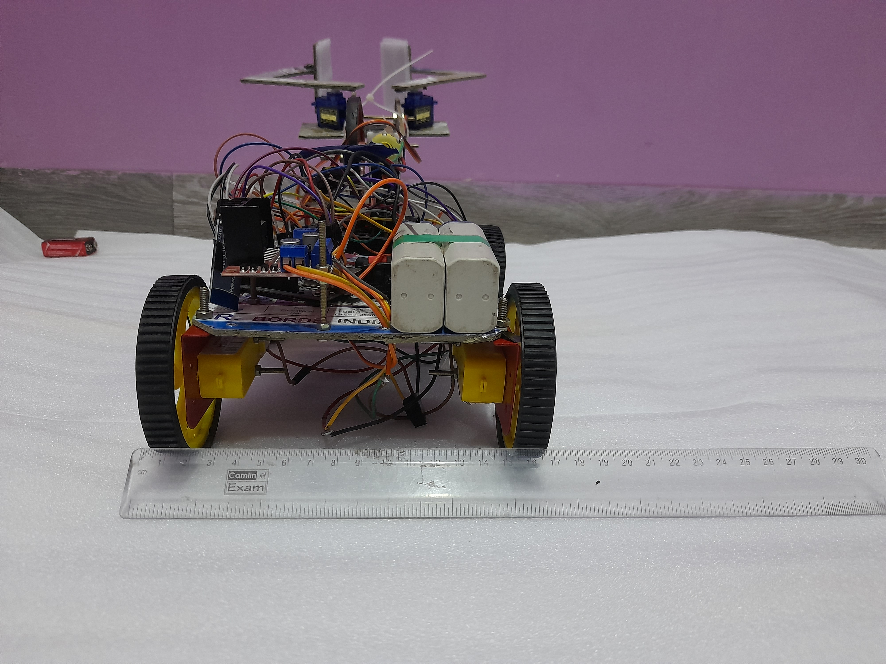
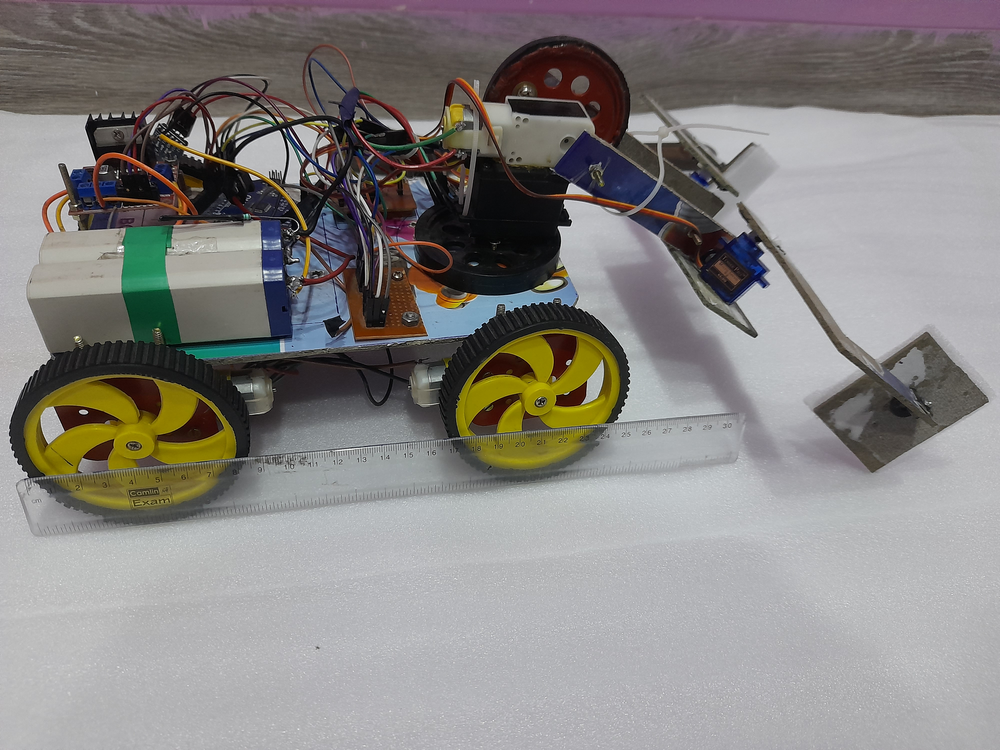

# Mobile_robotic_arm
(designed for cosmo clench techfest) 

The project is aimed to design a manually controlled wireless bot that can perform tasks
of grabbing the objects and dropping them to target zones. The bot is designed to
overcome various types of hurdles in the arena while performing tasks. The bot can be
operated from a 10m range using an android mobile application. The bot incorporates
with a remote-controlled car with a grabbing system, lifting arms, revolving base
provided with an onboard electrical power supply. 

## Mechanical and software overview : 

### User interface (sending control signals): 

Android Mobile Application is designed as a controller for the bot. 

■ The Application interfaces with the bot by sending a 1-byte number using the Bluetooth module which is received by Arduino Uno attached to the bot.  
■ Arduino Uno uses Serial communication for receiving the data from the Bluetooth module and executes the functions encoded in it according to the data received from the 
Bluetooth module for the operation of the bot.  
■ Arduino executes the operations by sending the digital signals for DC motors and PWM control signals for servo motors through GPIO Pins. 

 #### Mobile Application comprises of :  
● Push buttons for connecting the application with paired Bluetooth devices.  
● Touch buttons for the motion for the bot (forward, reverse, left, right) and movement of
lifting arm (up, down).  
● Sliders for setting the required angle of the rotating base and gripping range. 

■ The application used for controlling the bot is created on ‘MIT App Inventor 2’ (an Open
Source platform).
### MOTION OF BOT : 
》L298n Motor Driver is used for controlling the direction of DC motors.
The digital signals from the Arduino are received by Four Input pins of the motor driver, which
changes the direction of rotation of the two motors which are used for controlling the motion of
the bot.  
》Two motors are connected at each output socket of the motor driver used for controlling the
motion of the bot. 

## GRABBING MECHANISM
### The grabbing mechanism in this bot incorporates a rotating base, lifting arms, and grabber. 
### 1. ROTATING BASE:
Utility
A rotating base allows the grabber to access different locations precisely without changing the position of the bot. This reduces constraints from the bot and makes the controlling task easierfor the user. 

#### Mechanical Design 
Servo V3003 is used as the rotating base, Horn of the motor is mounted over the chassis and the base is attached to the lifting arm. The angle of rotation for the motor is controlled by setting the slider position to the required value. 
### 2. LIFTING ARMS: 

#### Utility 
》Lifting arm attached over the rotating base provides the grabber freedom to grab objects of
different sizes and also grabbing the objects from different heights helps the grabber to
overcome toppling of blocks while grabbing.  
》Lifting up the objects also makes the bot compact, ensuring that it does not face any difficulty
while moving in the arena. 
#### Mechanical Design 
》BO Motor is used as a lifter attached to the rotating base, 2 arms of sufficient lengths made
up of cardboard material are connected to the motor via wheel providing stability to the structure
motor used here provides sufficient amount of torque for lifting.  
》The direction of rotation of the motor is controlled by an L293d motor driver IC. 
### 3. GRABBER 
#### Utility 
Allows bot to grab objects from the initial position and tries to release them after reaching the
required position. 
#### Mechanical design  
》Involves crab-like grabbing design with 2 identical grabbers made of cardboard bending by a
suitable angle inwards after an appropriate length to ensure a better grip on the object.  
》Foams and Pads are attached at the end of each grabber to provide a proper surface for
grabbing.  
》The shape and size of grabbers (involving length of each grabber before the bend, after the
bend and angle of bend) have been chosen such that it works best for objects of size range
4-13cm keeping in mind the sizes and shapes of objects in the arena.  
》Servo motors are attached for the precise motion of these grabbers, one for each grabber,
and their angular motion is controlled by setting the slider to the required position. 

Note: The phase angle of the servo motor is shifted by 180 degrees to ensure the inward
movement of both arms while grabbing the object and outward move  
## Unique Selling Point (USP) 
● A 160-degree rotating base allows the bot to access different locations without changing
the orientation of the bot. As a result, the controller can grab and release the blocks to
the required position quickly and accurately without dragging the object.  
● This feature is especially helpful in regions of difficult terrain as a minimum movement of
a bot is sufficient. 
## Bot overview
 | 
 |  | 
## Components Required : 
Ic-L293d, L298n motordriver, Arduino uno, hc-5 bluetooth module, Bo motors 300rmp x40 Bo motor 150rpm, servo sg90 x2, servo v3003, jumpwires, batteries and wheels.
## Team Members : 
### Parees Pathak  
### Ojas Dighe  
### Parth Dhorajiya  
### Smit Savaliya  
